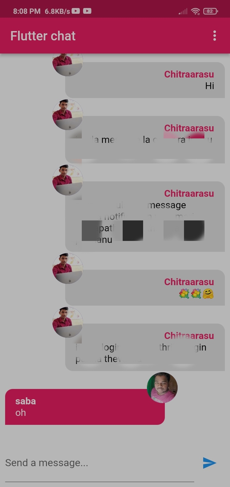

# Chat 😊

## I learnt this following thing from this project

- How to store extra user data in firebase.
- How to use form widget and validate user input.
- Learn about firebase storage to store user profile image.
- how to push notifications to users using cloud messaging.
- Learn more about firebase function to automate the push notification.

## Output

